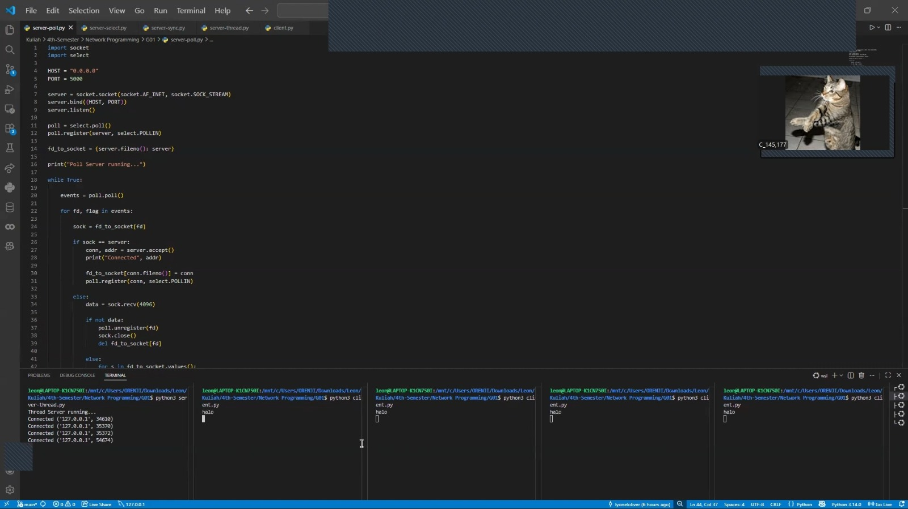
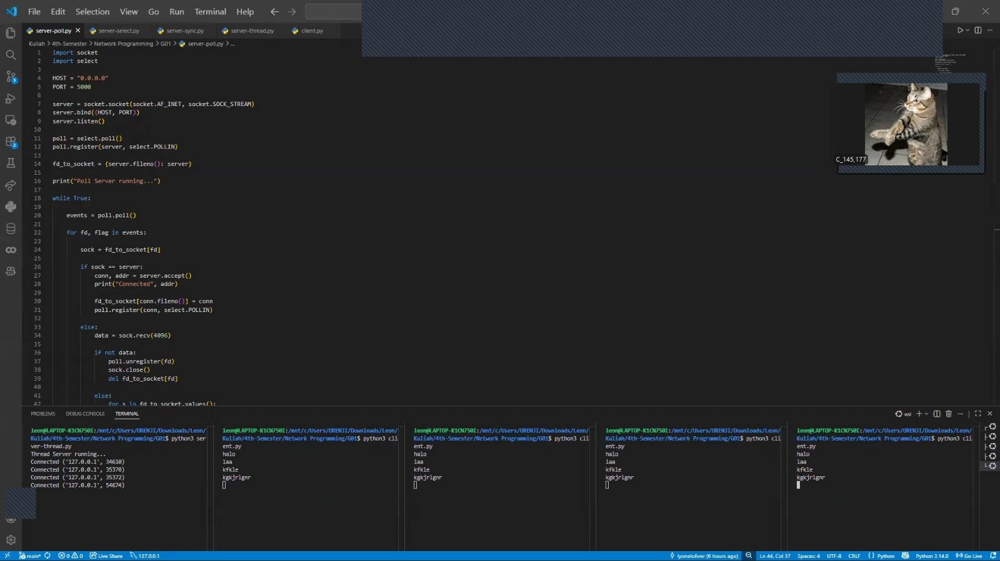
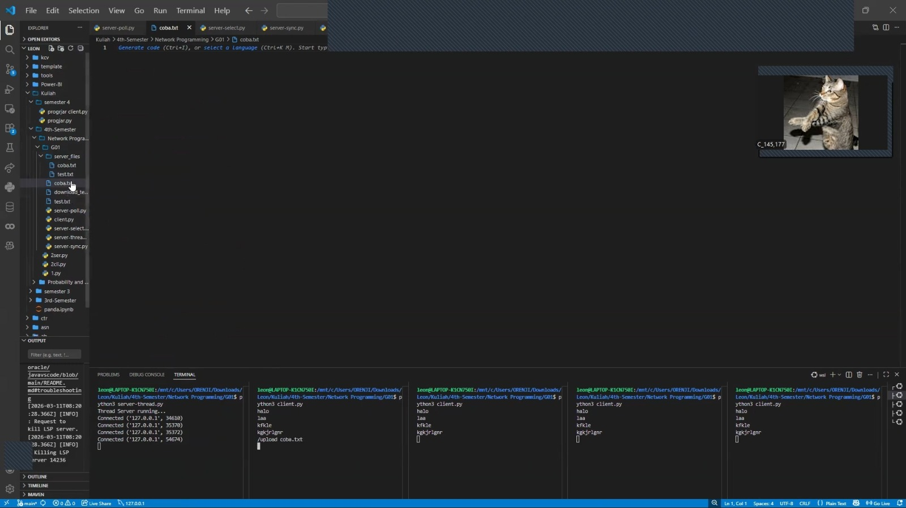
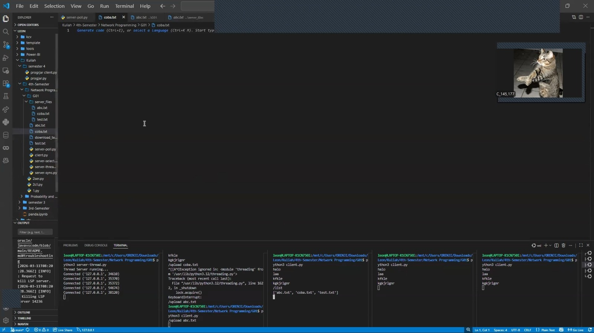
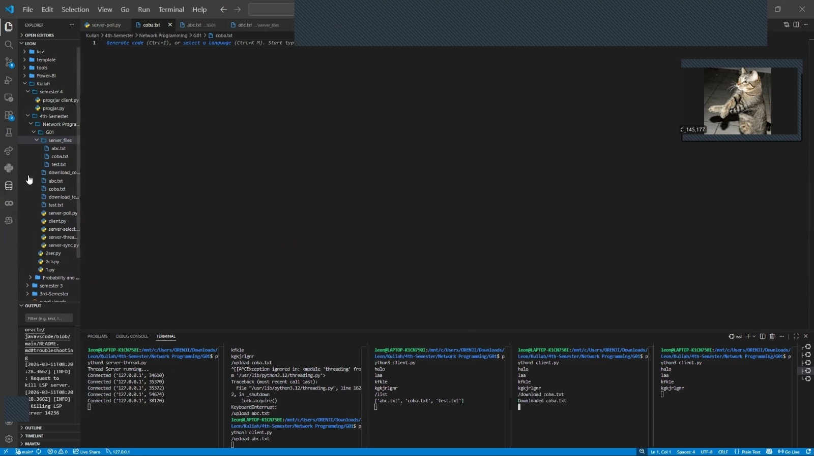

[](https://classroom.github.com/a/mRmkZGKe)
# Network Programming - Assignment G01

## Anggota Kelompok

| Nama                    | NRP        | Kelas |
|-------------------------|------------|-------|
| Lyonel Oliver Dwiputra  | 5025241145 | C     |
| Hosea Felix Sanjaya     | 5025241177 | C     |

## Link Youtube (Unlisted)
Link ditaruh di bawah ini
```
https://youtu.be/yX8AjO9mVlA
```

## Penjelasan Program
## client.py
File `client.py` adalah program yang digunakan oleh pengguna untuk terhubung ke server. Client membuat koneksi ke server menggunakan socket TCP dengan alamat dan port yang sudah ditentukan. Setelah terhubung, client bisa mengirim pesan ke server dan juga menerima pesan dari server.

Program ini menggunakan thread agar proses menerima pesan dari server dan mengirim pesan dari pengguna bisa berjalan bersamaan. Di client juga tersedia beberapa command, seperti:
- `/list` untuk melihat daftar file di server
- `/upload <filename>` untuk mengirim file ke server
- `/download <filename>` untuk mengambil file dari server

## server-sync.py
File `server-sync.py` adalah server yang menangani client secara berurutan. Ketika ada client yang terhubung, server akan memproses semua permintaan dari client tersebut terlebih dahulu. Jika ada client lain yang mencoba terhubung, koneksi tersebut harus menunggu sampai client yang sedang aktif selesai.

Server menerima pesan dari client, memproses command seperti melihat daftar file, upload file, dan download file, lalu mengirimkan respons kembali ke client yang terhubung.

## server-thread.py
File `server-thread.py` menggunakan modul `threading` untuk menangani banyak client. Setiap kali ada client yang terhubung, server akan membuat thread baru khusus untuk client tersebut.

Dengan cara ini beberapa client bisa berinteraksi dengan server secara bersamaan. Server juga dapat mengirim pesan broadcast ke semua client yang sedang terhubung dan memproses perintah seperti upload, download, dan melihat daftar file.

## server-select.py
File `server-select.py` menggunakan fungsi `select` untuk memantau beberapa socket sekaligus. Server menyimpan semua socket client yang sedang terhubung dalam satu daftar, lalu fungsi `select` akan memberi tahu server jika ada socket yang siap untuk dibaca.

Ketika ada client yang mengirim pesan, server akan membaca data dari socket tersebut dan memprosesnya. Dengan metode ini server dapat menangani banyak client dalam satu proses tanpa membuat thread baru.

## server-poll.py
File `server-poll.py` menggunakan mekanisme polling dengan fungsi `poll`. Server akan mendaftarkan socket yang ingin dipantau, kemudian `poll` akan memberi informasi jika ada aktivitas pada socket tersebut, seperti data yang masuk dari client.

Saat ada data dari client, server akan membaca data tersebut dan memprosesnya, misalnya mengirim pesan ke client lain atau menjalankan perintah tertentu. Metode ini mirip dengan `select`, tetapi biasanya lebih scalable untuk jumlah koneksi yang lebih banyak.
## Screenshot Hasil

## Broadcast Messages






### Langkah-langkah 
1. Buka 5 terminal (WSL bila di windows).
2. Nyalakan `server-thread.py` di terminal 1

    ```python
    python3 server-thread.py
    ```
4. Pastikan ada tulisan Terminal Server running... sebagai tanda bahwa server nyala.
5. Nyalakan `client.py` di terminal 2, 3, 4, dan 5

    ```python
    python3 client.py
    ```
6. Pastikan di terminal 1 ada tambahan baris Connected... sebagai tanda bahwa client sudah terhubung ke server.
7. Test dengan mengetikkan `halo` di salah satu client, maka akan keluar `halo` juga di client di terminal lain.

<br>

## /upload




### Langkah-langkah
1. Buka folder yang ada clientnya.
2. Tambahkan file `coba.txt`.
3. Masuk terminal client lalu ketik:

    ```python
    /upload coba.txt
    ```
4. Setelah itu `coba.txt` akan masuk ke `server_files`

> [!IMPORTANT] 
> Berlaku juga untuk file yang di dalamnya ada isinya.

<br>

## /list



### Langkah-langkah

<br>

## /download



### Langkah-langkah
